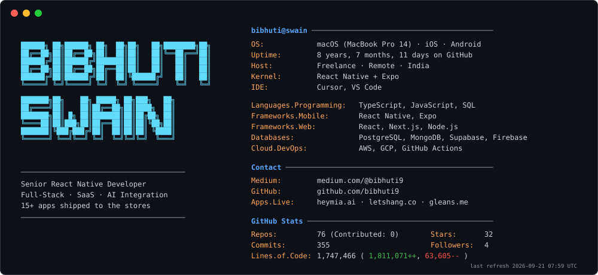

<picture>
  <source media="(prefers-color-scheme: dark)" srcset="generated/dark_mode.svg">
  <source media="(prefers-color-scheme: light)" srcset="generated/light_mode.svg">
  
</picture>

### 📱 Featured React Native work

| App | What it is |
| --- | --- |
| [Mia](https://heymia.ai/) | AI companion app |
| [Lets Hang](https://letshang.co/) | Social hangout planning |
| [Gleans](https://gleans.me) | Knowledge sharing |
| [Ainfluencer](https://ainfluencer.com/) | AI influencer marketplace |
| [Lompa Marketplace](https://apps.apple.com/us/app/lompa-marketplace/id6739612830) | iOS marketplace app |
| [Squad App](https://apps.apple.com/us/app/hypr-wallet-squadapp/id1583751406) | HYPR wallet companion |
| [Temptrack](https://app.temptrackapp.com) | Workforce management |

### 🛠️ What I work with

- **Mobile** — React Native, Expo (Router, OTA/EAS, Fastlane), Flutter, in-app purchases (RevenueCat, native IAP), payments (Stripe, Apple Pay, Google Pay), live streaming
- **Web & backend** — React, Next.js, Node.js, TypeScript, Laravel
- **Data & auth** — PostgreSQL, MongoDB, Supabase, Firebase (Functions, Auth, Emulator)
- **Tooling** — Monorepos (Nx, Turbo, Yarn), CI/CD to App Store & Google Play, Husky + ESLint + Prettier + Jest, AI-assisted development (Cursor, Copilot)

### ✍️ Writing

Articles on React Native and mobile engineering: [medium.com/@bibhuti9](https://medium.com/@bibhuti9)
